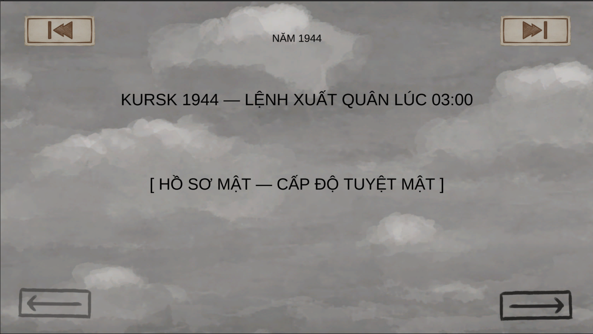
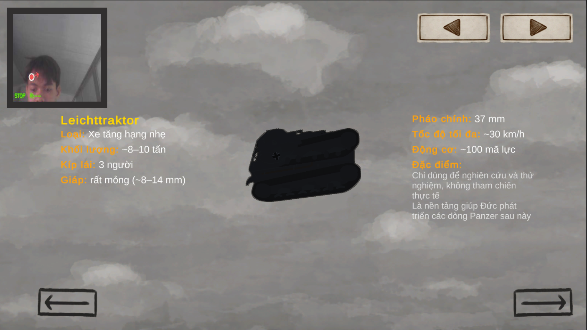

<h2 align="center">
   <a href="https://dainam.edu.vn/vi/khoa-cong-nghe-thong-tin">
   🎓 Faculty of Information Technology (DaiNam University)
   </a>
</h2>
<h2 align="center">
    Tank Trouble — Game Tank 2D Điều Khiển Bằng Tay
</h2>
<div align="center">
    <p align="center">
        
        
    </p>

[](https://www.facebook.com/DNUAIoTLab)
[](https://dainam.edu.vn/vi/khoa-cong-nghe-thong-tin)
[](https://dainam.edu.vn)

</div>

---

## 📖 1. Giới thiệu

**Tank Trouble** là game bắn tank 2D theo thể loại arena, xây dựng trên nền tảng **Unity 6** với **Universal Render Pipeline (URP)**. Điểm nổi bật của dự án là tích hợp **điều khiển bằng cử chỉ tay thật qua webcam** sử dụng Python và MediaPipe — cho phép người chơi di chuyển xe tăng, ngắm bắn và khai hỏa chỉ bằng bàn tay trước camera.

Game có hệ thống AI enemy thông minh (A\* Pathfinding + State Machine), nhiều loại map với modifier riêng (sương mù, item drops), và hệ thống vật phẩm đa dạng (hồi máu, khiên).

---

## ⚙️ Các tính năng chính

### 1. Chiến đấu Tank 2D
- Di chuyển xe tăng, xoay turret và bắn đạn
- Đạn hỗ trợ **ricochet** (bật tường theo góc)
- **Đâm xe (ram)** gây knockback và damage, tạm khóa input sau va chạm
- **Shield** hấp thụ damage trước khi trừ HP

### 2. AI Enemy thông minh
- Hệ thống **State Machine**: Patrol → Alert → Chase → Attack → Search
- **A\* Pathfinding** — tìm đường né vật cản tự động
- **Line of Sight** — phát hiện player có kiểm tra tường chắn
- **Boids separation** — các enemy không chồng chéo lên nhau

### 3. Điều khiển bằng tay (Hand Control)
- Nhận diện cử chỉ tay qua **webcam** bằng Python + MediaPipe
- Giao tiếp Unity ↔ Python qua **TCP Socket** (port 9999)
- Preview webcam trực tiếp trong game UI (TCP port 9998)
- Có thể chuyển đổi giữa **Keyboard** và **Hand Control** trong Settings

### 4. Hệ thống vật phẩm (Items)
- Spawn định kỳ trên map loại **HasItem**
- **Health Pickup** — hồi máu
- **Shield Pickup** — thêm điểm khiên

### 5. Map và chế độ chơi
- Nhiều map khác nhau (Forest, Snow, ...)
- **Normal** — đấu thuần túy
- **HasItem** — spawn vật phẩm ngẫu nhiên trong trận
- **HasFog** — sương mù giới hạn tầm nhìn

---

## 📸 Giao diện & Chức năng

### Màn hình cốt truyện
Hiển thị phần giới thiệu bối cảnh game trước khi bắt đầu trận đấu. 
Người chơi sẽ được dẫn dắt vào thế giới chiến trường với phần intro ngắn, tạo cảm giác kịch tính và định hướng nhiệm vụ.

<p align="center">
  
</p>

<p align="center"><i>Màn hình intro cốt truyện trước khi vào game</i></p>

### Màn hình chọn Tank
Carousel 3D xoay tank, kéo chuột để xem góc độ, hiển thị thông số bằng TextMeshPro.

| Chọn Tank | Thông số Tank |
|:---:|:---:|
|  |  |
| *Gallery xe tăng xoay 3D* | *Thông số và mô tả chi tiết* |

### Màn hình chọn Map
Chọn map → chọn chế độ chơi → vào trận.

| Chọn Map | Chọn chế độ |
|:---:|:---:|
|  |  |
| *Danh sách map có thể chơi* | *Normal / HasItem / HasFog* |

### HUD trong trận
Thanh máu, cooldown bắn, crosshair, damage popup nổi số.

| Combat HUD | Damage Popup |
|:---:|:---:|
|  |  |
| *Thanh máu player và enemy* | *Số damage nổi lên khi trúng đạn* |

### Settings & Hand Control
Cài đặt nhạc, âm thanh, chế độ điều khiển; kết nối Python webcam.

| Settings Panel | Hand Control Connect |
|:---:|:---:|
|  |  |
| *Popup Settings có thể mở bất kỳ lúc nào* | *Màn hình kết nối webcam* |

### Màn hình kết quả
Win/Lose với hiệu ứng fade, replay hoặc về menu chính.

| Chiến thắng | Thất bại |
|:---:|:---:|
|  |  |
| *Màn hình thắng* | *Màn hình thua* |

---

## 🔧 2. Công nghệ sử dụng

<div align="center">

### Game Engine
[](https://unity.com/)
[](https://unity.com/srp/universal-render-pipeline)

### Ngôn ngữ lập trình
[](https://learn.microsoft.com/en-us/dotnet/csharp/)
[](https://www.python.org/)

### Thư viện & Plugin
[](https://mediapipe.dev/)
[](http://dotween.demigiant.com/)
[](https://odininspector.com/)
[](https://arongranberg.com/astar/)

### Giao thức
[]()

</div>

---

## 🚀 3. Cài đặt

### 3.1. Yêu cầu hệ thống

| Thành phần | Yêu cầu |
|---|---|
| Unity | **6000.0.71f1** (bắt buộc đúng version) |
| Python | **3.10+** (chỉ cần nếu dùng Hand Control) |
| OS | Windows 10/11 |
| Webcam | Bất kỳ (chỉ cần nếu dùng Hand Control) |

### 3.2. Clone project

```bash
git clone https://github.com/<your-username>/Tank-2d-Unity.git
cd Tank-2d-Unity
```

> Nếu repo dùng **Git LFS**, chạy thêm:
> ```bash
> git lfs pull
> ```

### 3.3. Mở project trong Unity

1. Mở **Unity Hub** → nhấn **Add** → chọn thư mục vừa clone
2. Chọn đúng Unity version **6000.0.71f1** để mở
3. Unity sẽ tự động import tất cả packages (DOTween, Odin, A\*, URP...)
4. Sau khi import xong, mở scene **`Assets/Scenes/MapSelection.unity`** để chạy từ đầu

### 3.4. Cài đặt Hand Control (tuỳ chọn)

Bước này chỉ cần nếu muốn sử dụng tính năng **điều khiển bằng tay qua webcam**.

#### 3.4.1. Tạo môi trường ảo Python

```bash
cd Python
python -m venv .venv
```

#### 3.4.2. Kích hoạt môi trường ảo

```bash
# Windows
.venv\Scripts\activate

# macOS / Linux
source .venv/bin/activate
```

#### 3.4.3. Cài đặt thư viện

```bash
pip install mediapipe opencv-python
```

#### 3.4.4. Chạy thủ công (để test)

```bash
python hand_control_socket.py
```

> **Trong game:** Vào Settings → bật **Hand Control** → Unity sẽ tự khởi động Python subprocess và kết nối qua TCP port **9999**.

### 3.5. Build game (Windows)

1. Mở **File → Build Settings** trong Unity Editor
2. Chọn platform **Windows** → nhấn **Build**

---

## 📝 4. License

© 2025 AIoTLab, Faculty of Information Technology, DaiNam University. All rights reserved.

---